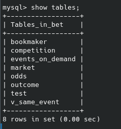
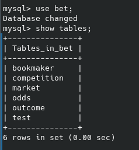
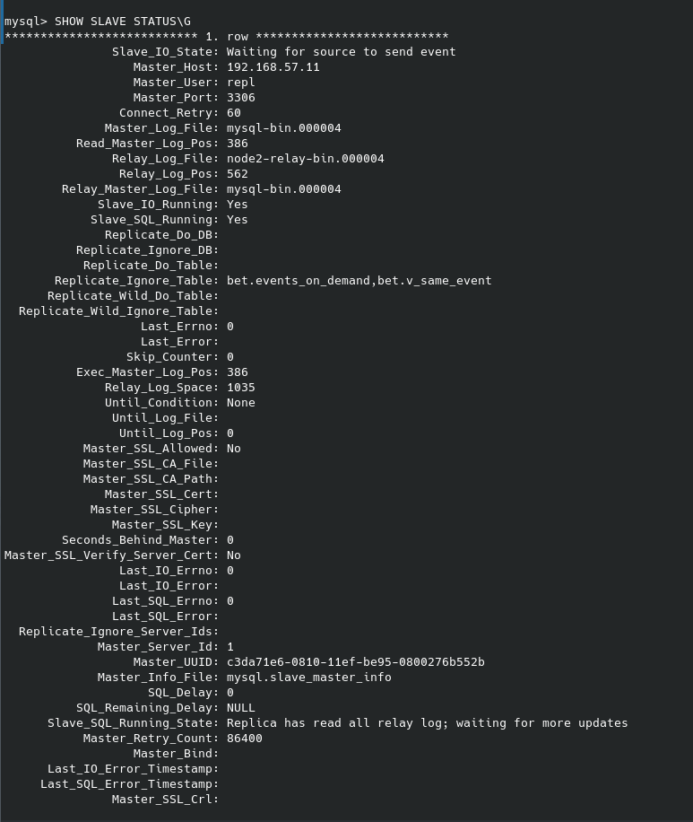

# Mysql

Репликация в СУБД MySQL

Базу развернул на мастере и настроил так, чтобы реплицировались таблицы.

Таблицы на мастере 

Таблицы на слейве 

Статус репликации 

Создал тестовую таблицу test и проверил что она успешно реплицировалась на слейв.
